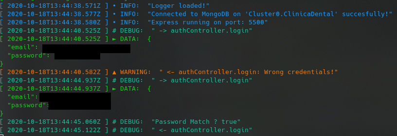

# Rest API for appointment app for a Dental Clinic

This is a project to introduce the use of nodejs, express, mongooose and mongodb.

### Where to test the demo
-> https://appointment-dentist.herokuapp.com/

### A bit of background
This is an example of a backend for an appointment app for a dental clinic.

We have 3 roles for user: Client, Dentist, Admin.
The Client can see the previos appointments and create new ones in 'pending' state
The Dentist can see previos appointments from a certain Client, see own history of appointment. Also and create new appointments and change the status of them.
The Admin can do All the previous stuff and elevate o revoke roles of the users. also can logout any user on the app.

### Data Structure

Users collection: contains all the users in one collection, the backen know by roleId which type of user id [Client, Dentist, Admin].
Appointments collections: contains all the info for the appointments between Client and Dentist.

### Software needed
- nodejs lts (at the time, version 12.19.0)
- mongodb service running
- mongoose for manage the acces to DB and define models.

### Get the repo
- git clone https://github.com/RafaLinaresMolina/FSD-BookingDentistApp.git

### Install dependencies
- ```npm i```

### Add the configuration 

- Add the .env file with the next variables:
  - MONGO_USER: User for acces the cluster
  - MONGO_PASS: Password fo the previous user
  - MONGO_CLUSTER: The cluster name
  - MONGO_DB: The DAtaBase name
  - PORT: The port for express
  - MINIMUM_LEVEL_LOG: Log has 5 levels: Error, Warning, Debug, Info, Data. Setting this limits the levels showed.
    
    - Error: display the message in red, level 0: used for display message from crashes.
    - Warning: display the message in orange, level 1: used for minor mistakes (like search an user by a wrong id and return empty resource)
    - Debug: display the message in blue, level 2: used for keep the executing flow.
    - Info: display the message in light blue, level 3: Used for trivial information like 'Server is runing on Port...' 
    - Data: display the message in light green, level 4: Used for display data from request.
  - SECRET_AUTH_JWT: Secret for Jwt generation

### How to run it.
- ```npm run start```

## The endpoints

We have this prefixes:
  - /Clients: for actions that can manage the clients
    - post /appointment [logged]
    - delete /appointment [logged]
    - put /account [logged]
    - delete /account [logged]
    - get /appointments [logged]
    - get /appointmentsbetweenDates [logged]


  - /Dentist: for actions that can manage the Dentists
    - post /appointment [logged, mustBeDentist]
    - put /appointment [logged, mustBeDentist]
    - put /appointment/cancel [logged, mustBeDentist]
    - put /appointment/confirm [logged, mustBeDentist]
    - put /appointment/done [logged, mustBeDentist]
    - delete /appointment [logged, mustBeDentist]
    - put /account [logged, mustBeDentist]
    - delete /account [logged, mustBeDentist]
    - get /appointments [logged, mustBeDentist]
    - get /appointments/user [logged, mustBeDentist]
    - get /appointmentsbetweenDates [logged, mustBeDentist]

  - /Admin: for actions that can manage the Admins
    - post /appointment [logged, mustBeAdmin]
    - delete /appointment [logged, mustBeAdmin]
    - put /appointment [logged, mustBeAdmin]
    - put /appointment/confirm [logged, mustBeAdmin]
    - put /appointment/done [logged, mustBeAdmin]
    - put /account [logged, mustBeAdmin]
    - put /account/user [logged, mustBeAdmin]
    - delete /account [logged, mustBeAdmin]
    - put /roles/client [logged, mustBeAdmin]
    - put /roles/dentist [logged, mustBeAdmin]
    - put /roles/admin [logged, mustBeAdmin]
    - get /appointments/dentist [logged, mustBeAdmin]
    - get /appointments/Client [logged, mustBeAdmin]
    - get /appointmentsbetweenDates [logged, mustBeAdmin]


### Things i will add

- A bloody swagger file
- Unit-Testing
- Refactor